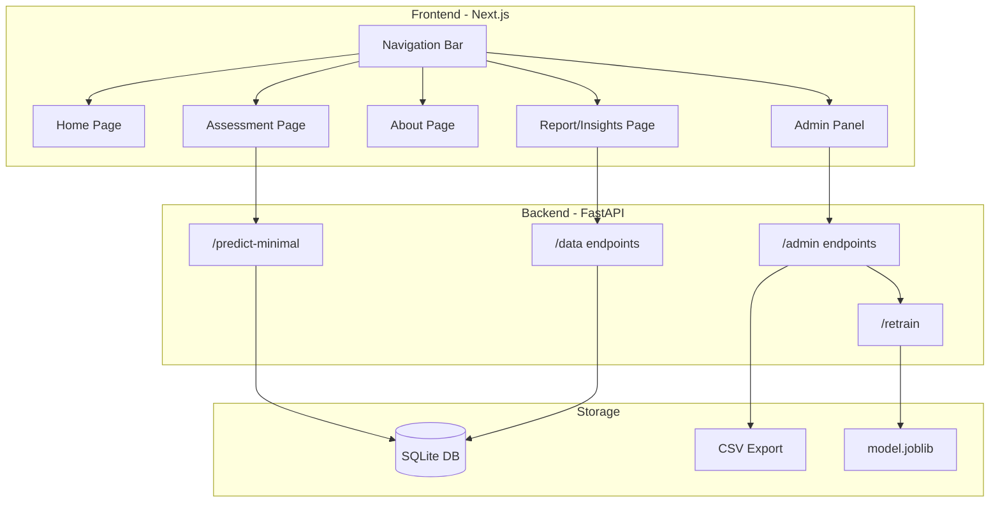

# Mind-Bloom Professional Upgrade Plan

## Architecture Overview



---

## Part 1: SQLite Database + Data Collection

### Backend Changes ([mindBloom/backend/main.py](mindBloom/backend/main.py))

1. **Add SQLite setup** with `sqlite3` (no extra dependencies):

   - Table: `predictions` (id, timestamp, all user inputs, risk_level, probabilities)
   - Table: `feedback` (id, prediction_id, actual_outcome, notes)

2. **New endpoints**:

   - `POST /predictions/save` - Auto-save after each prediction
   - `GET /predictions` - Get all predictions (for Report page)
   - `GET /predictions/export-csv` - Export to CSV
   - `GET /data-stats` - Statistics for dashboard

3. **Update** existing `/predict-minimal` to auto-save to SQLite.

### New file: [mindBloom/backend/database.py](mindBloom/backend/database.py)

```python
import sqlite3
from datetime import datetime

DB_PATH = "mindbloom.db"

def init_db():
    conn = sqlite3.connect(DB_PATH)
    conn.execute("""
        CREATE TABLE IF NOT EXISTS predictions (
            id INTEGER PRIMARY KEY AUTOINCREMENT,
            timestamp TEXT,
            user_inputs TEXT,  -- JSON
            risk_level TEXT,
            probabilities TEXT,  -- JSON
            phq9_score INTEGER
        )
    """)
    conn.commit()
    conn.close()
```

---

## Part 2: Multi-Page Navigation (GridGenius Style)

### Frontend Structure

Convert to multi-page app with shared navigation:

```
mindBloom/frontend/app/
├── layout.tsx          # Add NavBar here (shared across all pages)
├── components/
│   └── NavBar.tsx      # NEW: Professional navigation component
├── page.tsx            # Home page (new landing page)
├── assessment/
│   └── page.tsx        # Move current form here
├── about/
│   └── page.tsx        # Project info, team, methodology
├── report/
│   └── page.tsx        # Statistics, charts, insights
└── admin/
    └── page.tsx        # CSV upload, data management, retrain
```

### NavBar Design (GridGenius inspired)

- Dark theme with gold/yellow accents
- Logo: "Mind-Bloom" with flower icon
- Links: Home | Assessment | Report | About | Admin
- Mobile responsive hamburger menu

### Home Page Content

- Hero section: "PPD Risk Assessment for Bangladeshi Mothers"
- Feature cards (like GridGenius): PHQ-9 Assessment, AI Prediction, Data Insights
- CTA button: "Start Assessment"

---

## Part 3: Admin Panel + CSV Upload

### Admin Page Features ([mindBloom/frontend/app/admin/page.tsx](mindBloom/frontend/app/admin/page.tsx))

1. **Dashboard Stats**:

   - Total predictions count
   - Risk level distribution (pie chart)
   - Recent predictions table

2. **CSV Upload Section**:

   - Drag-and-drop file upload
   - Preview uploaded data
   - "Add to Training Data" button

3. **Model Management**:

   - "Export Current Data as CSV" button
   - "Retrain Model" button (calls `/retrain` endpoint)
   - Show last retrain timestamp

### Backend Endpoints ([mindBloom/backend/main.py](mindBloom/backend/main.py))

```python
@app.post("/admin/upload-csv")
def upload_csv(file: UploadFile):
    # Parse CSV and add to training_data table
    
@app.post("/admin/retrain")
def retrain_model():
    # Load all data from SQLite
    # Combine with original training data
    # Retrain ensemble model
    # Save new model.joblib
```

---

## Implementation Order

| Step | Task | Files |

|------|------|-------|

| 1 | Create SQLite database module | `backend/database.py` |

| 2 | Add data collection endpoints | `backend/main.py` |

| 3 | Create NavBar component | `frontend/app/components/NavBar.tsx` |

| 4 | Update layout with NavBar | `frontend/app/layout.tsx` |

| 5 | Create Home landing page | `frontend/app/page.tsx` (replace) |

| 6 | Move form to Assessment page | `frontend/app/assessment/page.tsx` |

| 7 | Create About page | `frontend/app/about/page.tsx` |

| 8 | Create Report page with charts | `frontend/app/report/page.tsx` |

| 9 | Create Admin panel | `frontend/app/admin/page.tsx` |

| 10 | Add CSV upload + retrain | Backend + Admin UI |

---

## Notes

- **No new dependencies needed** for SQLite (built into Python)
- **Recharts** can be used for Report page charts (already common with Next.js)
- **Current UI styling preserved** - just reorganized into pages
- **Firefly background** will be kept on all pages via layout.tsx